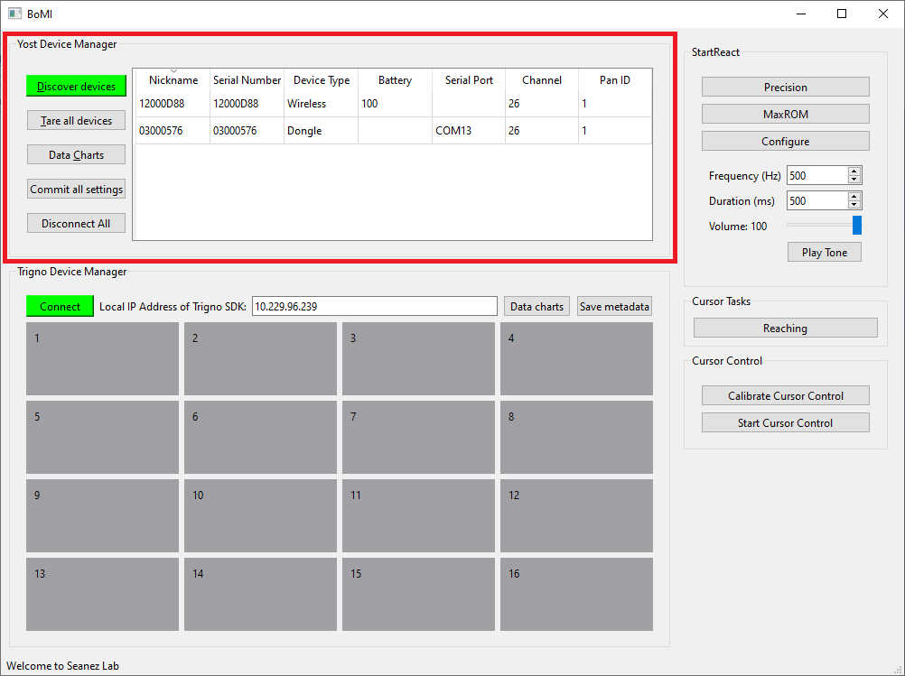
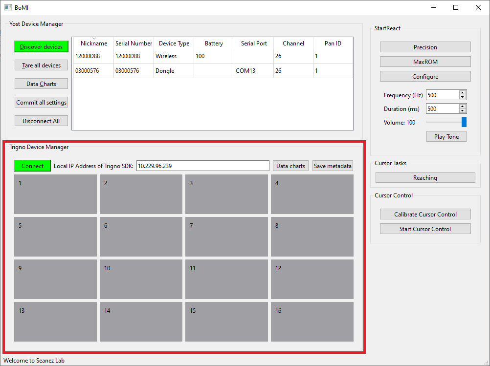
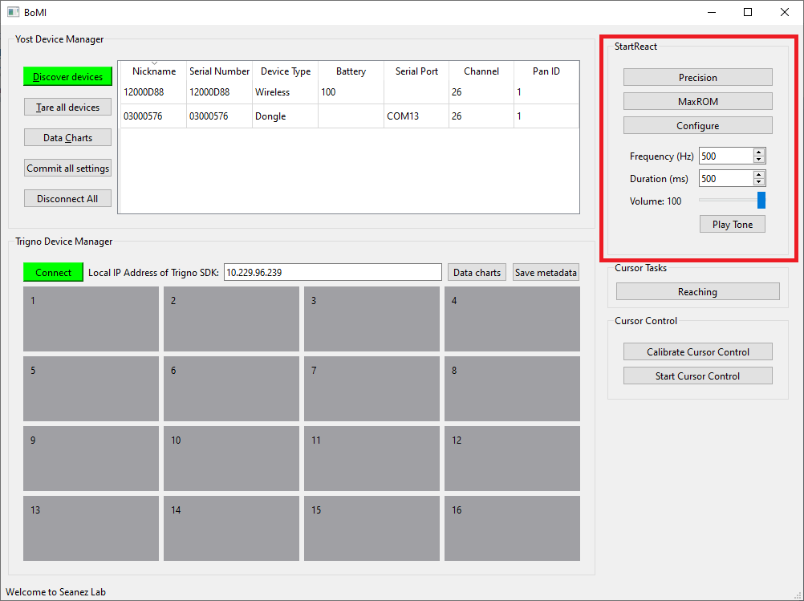
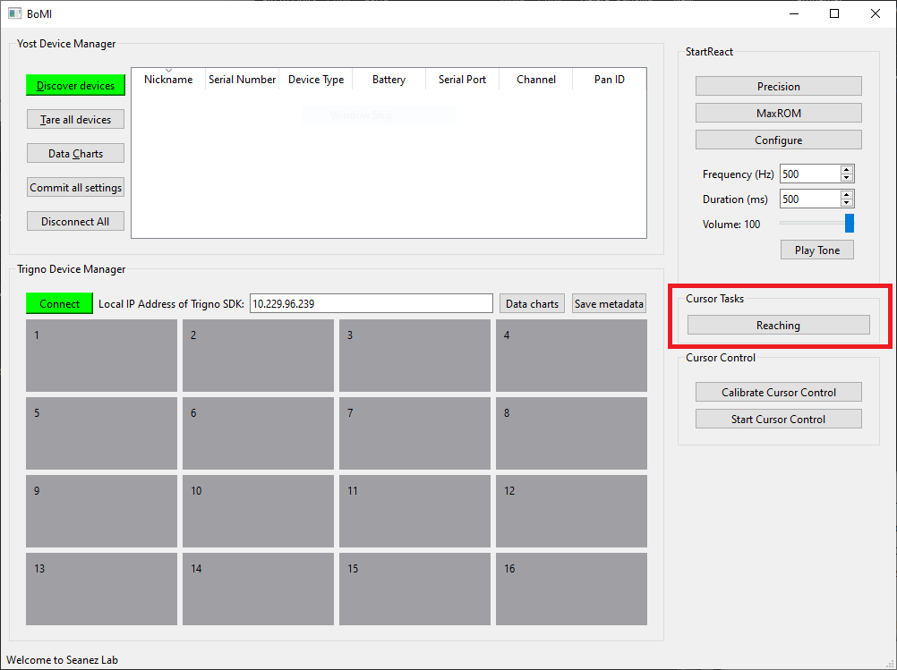
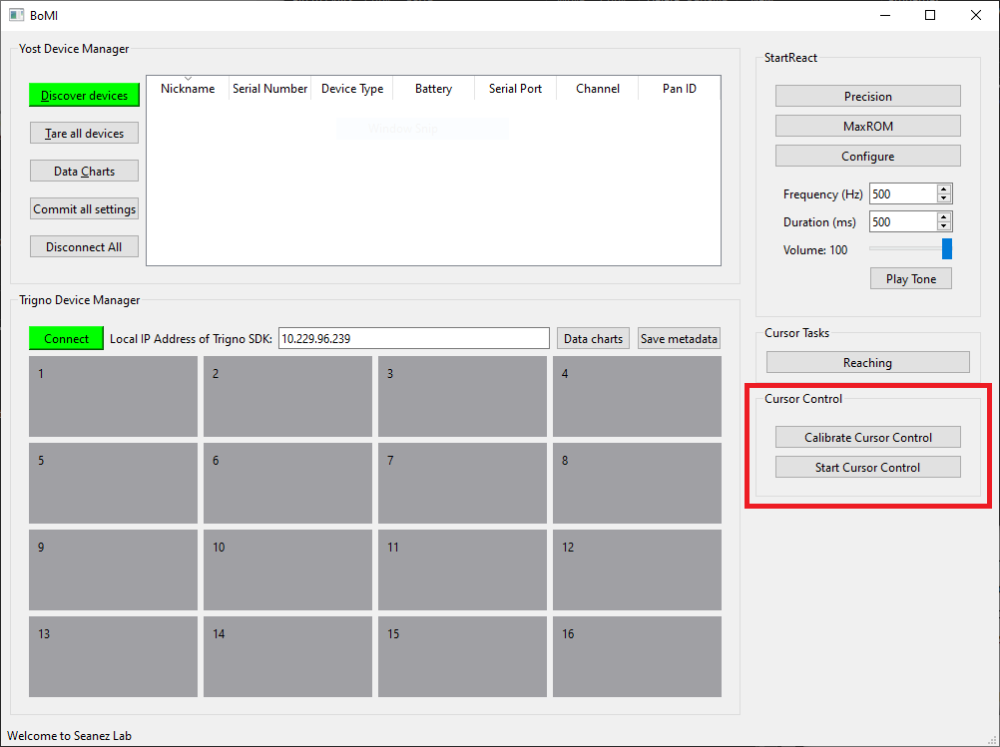

# Overview of the BoMI GUI

The home screen is divided into Group Boxes, grouped by functionality.

- ["Yost devices" Widget](#-yost-devices--widget)
- ["Trigno devices" Widget](#-trigno-devices--widget)
- [StartReact](#startreact)
- [Cursor Tasks](#cursor-tasks)
- [Cursor Control](#cursor-control)

## "Yost devices" Widget

The "Yost devices" widget manages the [Yost 3-Space Sensors](https://yostlabs.com/3-space-sensors/), which provides BoMI with real-time orientation data.
Plug the sensors or dongles via USB to the computer, then click "**Discover Devices**" to see a list of devices.

"**Tare all devices**" tares all wired and wireless sensors.

"**Data charts**" brings up a scope that visualizes orientation data from all connected sensors. Certain columns of the table showing the list of devices are editable:

- Nicknames: set a custom name to the devices (e.g., knee, ankle) that will be shown in the scope and in the saved data.
- Channel: wireless channel of the Yost sensor. Only editable when a wireless sensors is connected through USB.
- Pan ID: wireless pan ID of the Yost sensor. Only editable when a wireless sensors is connected through USB.

(For a sensor and dongle to pair, they must be using the same _Channel_ and _Pan ID_. It's easier to set this through the **3-Space Sensor Suite GUI**).

"**Commit all settings**" commits the edited settings to device. (Nickname is only saved during a BoMI session and not persisted to device)

"**Disconnect all**" disconnects from all devices and dongles.

## "Trigno devices" Widget

The "Trigno devices" widget manages the [Trigno Research System](https://delsys.com/trigno/) from Delsys.
Make sure the **Trigno Control Utility** (Trigno SDK Server) is running on the computer connected to the Base Station, and the IP address of the computer is entered correctly, then click "**Connect**" to connect to the Base Station.

**Use the sensor widgets to assign a muscle to each sensor before collecting data.**

## StartReact

- **"Configure"** opens a dialog window to adjust configuration parameters.
- **"Precision"** Launches the precision control task.
- **"MaxROM"** Launches the max range of motion task.

You can play a tone at **Frequency**, **Duration** and **Volume** by clicking **"Play tone"**. Note that this setting is for testing sound only, and is not used in the StartReact task. To adjust task settings, click **"Configure"**.

## Cursor Tasks

Implements some cursor tasks that are fun and can quantify accuracy and speed.

## Cursor Control

Use a Yost device to control the cursor on screen.
